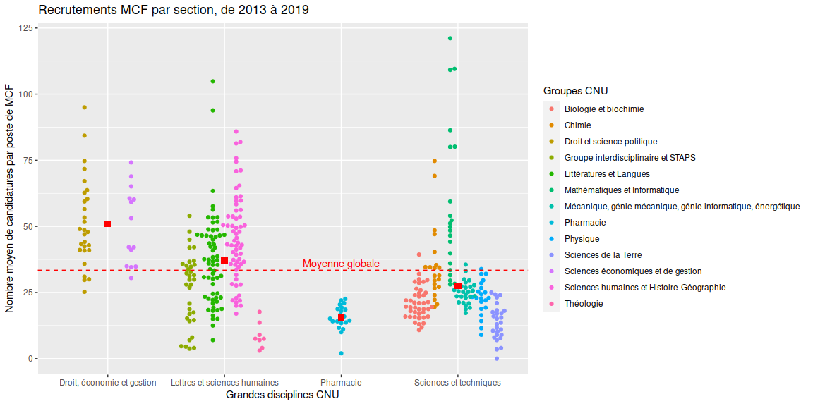
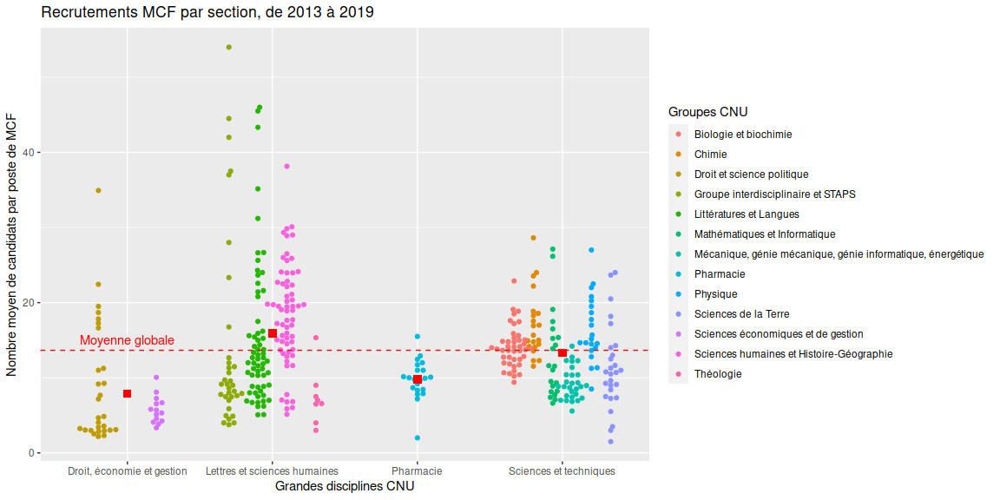
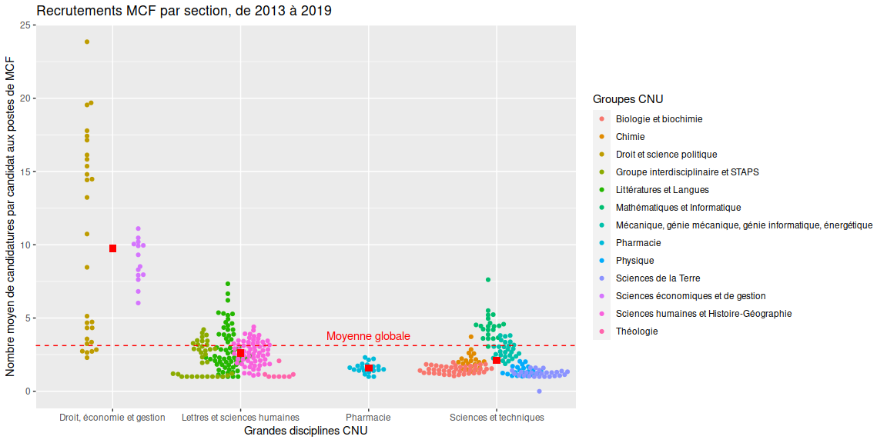

emploiESR
================
23/11/2020

  - [1 L’emploi dans l’ESR](#lemploi-dans-lesr)
      - [1.1 Description](#description)
      - [1.2 Analyse des recrutements
        MCF](#analyse-des-recrutements-mcf)
          - [1.2.1 Nombre moyen de candidatures par poste de
            MCF](#nombre-moyen-de-candidatures-par-poste-de-mcf)
          - [1.2.2 Nombre moyen de candidats par poste de
            MCF](#nombre-moyen-de-candidats-par-poste-de-mcf)
          - [1.2.3 Nombre moyen de candidatures par candidat aux postes
            de
            MCF](#nombre-moyen-de-candidatures-par-candidat-aux-postes-de-mcf)

# 1 L’emploi dans l’ESR

## 1.1 Description

Ce document rassemble les analyses sur les statistiques et dynamiques
des emplois dans l’ESR, incluant entre autres les qualifications CNU,
les recrutements MCF/PU ou les recrutements dans les EPST (CNRS, INSERM,
etc.).

## 1.2 Analyse des recrutements MCF

### 1.2.1 Nombre moyen de candidatures par poste de MCF

``` r
library(ggplot2)
library(ggbeeswarm)
library("gridExtra")
data_CNU = read.table("DB_CNU_QualificationRecrutements_20201123.csv", h=T, sep=";")
tapply(data_CNU$Candidatures.MCF/data_CNU$PostesPublies.MCF, data_CNU$TypeRecrutement, mean, na.rm=T)
```

    ##     CNU 
    ## 33.4269

``` r
plot_CandidaturesParPosteMCF = ggplot(data_CNU, aes(x = GrandeDisciplineCNU, y = Candidatures.MCF/PostesPublies.MCF, color=GroupeCNU)) + 
  geom_beeswarm(cex = 1, dodge.width = 0.8) + 
  geom_hline(yintercept=33.4269, linetype="dashed", color = "red") + 
  stat_summary(fun=mean, geom="point", shape=15, size=3, color="red") + 
  labs(title="Recrutements MCF par section, de 2013 à 2019", x ="Grandes disciplines CNU", y = "Nombre moyen de candidatures par poste de MCF") +
  labs(color = "Groupes CNU") + 
  annotate(geom="text", x=3, y=36, label="Moyenne globale", color="red")
```

    ## Warning: Removed 464 rows containing non-finite values (stat_summary).

    ## Warning: Removed 464 rows containing missing values (position_beeswarm).

<!-- -->

### 1.2.2 Nombre moyen de candidats par poste de MCF

``` r
tapply(data_CNU$Candidats.MCF/data_CNU$PostesPublies.MCF, data_CNU$TypeRecrutement, mean, na.rm=T)
```

    ##      CNU 
    ## 13.65133

``` r
plot_CandidatsParPosteMCF = ggplot(data_CNU, aes(x = GrandeDisciplineCNU, y = Candidats.MCF/PostesPublies.MCF, color=GroupeCNU)) + 
  geom_beeswarm(cex = 1, dodge.width = 0.8) + 
  geom_hline(yintercept=13.65133, linetype="dashed", color = "red") + 
  stat_summary(fun=mean, geom="point", shape=15, size=3, color="red") + 
  labs(title="Recrutements MCF par section, de 2013 à 2019", x ="Grandes disciplines CNU", y = "Nombre moyen de candidats par poste de MCF") +
  labs(color = "Groupes CNU") + 
  annotate(geom="text", x=1, y=15, label="Moyenne globale", color="red")
```

    ## Warning: Removed 464 rows containing non-finite values (stat_summary).

    ## Warning: Removed 464 rows containing missing values (position_beeswarm).

<!-- -->

### 1.2.3 Nombre moyen de candidatures par candidat aux postes de MCF

``` r
tapply(data_CNU$Candidatures.MCF/data_CNU$Candidats.MCF, data_CNU$TypeRecrutement, mean, na.rm=T)
```

    ##      CNU 
    ## 3.118721

``` r
plot_CandidaturesParCandidatMCF = ggplot(data_CNU, aes(x = GrandeDisciplineCNU, y = Candidatures.MCF/Candidats.MCF, color=GroupeCNU)) + 
  geom_beeswarm(cex = 1, dodge.width = 0.8) + 
  geom_hline(yintercept=3.118721, linetype="dashed", color = "red") + 
  stat_summary(fun=mean, geom="point", shape=15, size=3, color="red") + 
  labs(title="Recrutements MCF par section, de 2013 à 2019", x ="Grandes disciplines CNU", y = "Nombre moyen de candidatures par candidat aux postes de MCF") +
  labs(color = "Groupes CNU") + 
  annotate(geom="text", x=3, y=3.8, label="Moyenne globale", color="red")
```

    ## Warning: Removed 464 rows containing non-finite values (stat_summary).

    ## Warning: Removed 464 rows containing missing values (position_beeswarm).

<!-- -->
